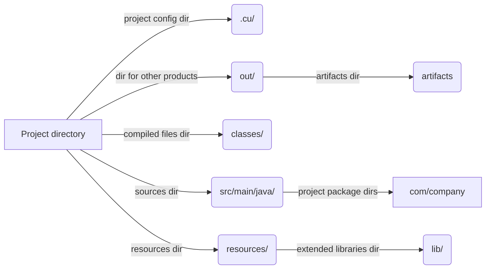

# Java Console Utilities

Utilities for working with Java in Linux Console

### Project structure

```mermaid
graph LR
A[Project directory]
    A --> |project config dir| B(.cu/)
    A --> |dir for other products| M(out/)
    M --> |artifacts dir| D(artifacts)
    A --> |compiled files dir| F(classes/)
    A --> |sources dir| H(src/main/java/)
    H --> |project package dirs| K[com/company]
    A --> |resources dir| J(resources/)
    J --> |extended libraries dir| G(lib/)
```
